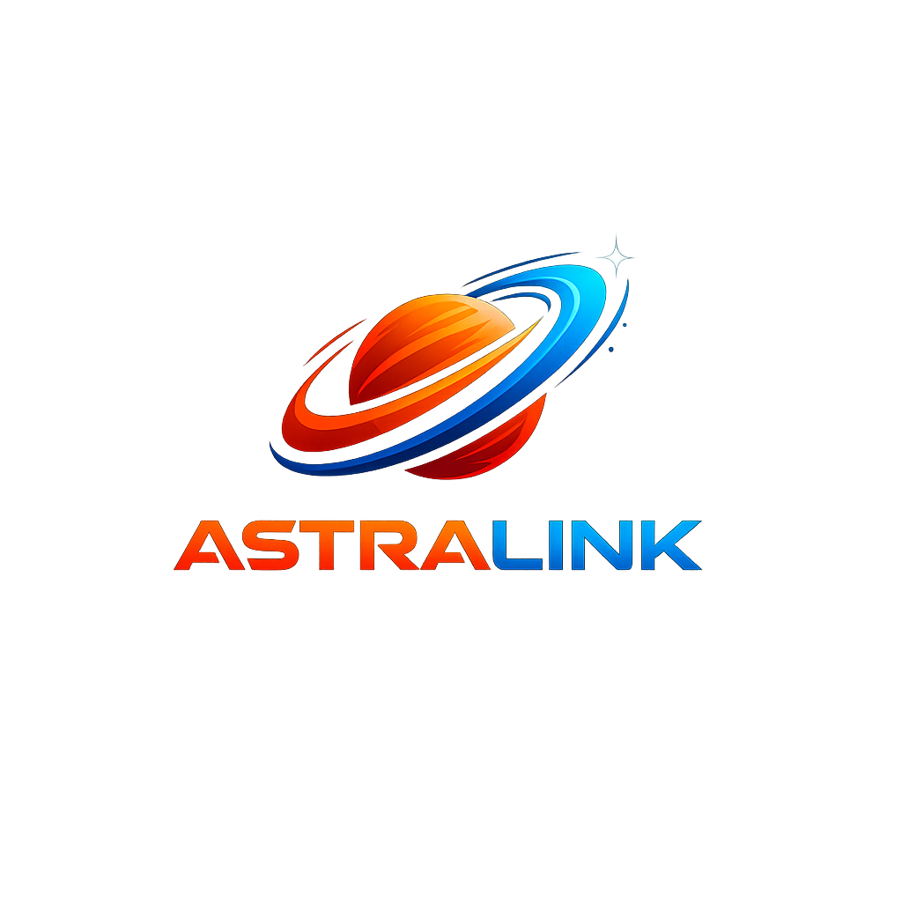

<div align="center">

# 🚀 AstraLink Mission Control



### Plataforma de comunicação e coordenação para missões espaciais em Marte

Projeto desenvolvido para o desafio da FIAP sobre Economia Espacial, conectando tecnologia, comunicação resiliente e inovação full stack.

</div>

---

# 📖 Sobre o Projeto

O **AstraLink Mission Control** é uma plataforma integrada criada para auxiliar a comunicação entre uma tripulação em Marte e o centro de controle na Terra.

O sistema foi projetado para funcionar em cenários extremos, considerando:

- alta latência;
- comunicação assíncrona;
- conexões instáveis;
- sincronização offline;
- monitoramento da missão;
- gerenciamento de tarefas críticas.

A arquitetura foi inspirada nos desafios reais da economia espacial moderna e nas futuras missões tripuladas para Marte.

---

# 🌌 Objetivo

Criar uma solução tecnológica robusta capaz de:

✅ conectar equipes em ambientes extremos  
✅ funcionar com internet limitada  
✅ permitir comunicação assíncrona  
✅ monitorar missões em tempo real  
✅ integrar aplicações web, mobile e backend  

---

# 🛰️ Funcionalidades

## 🌍 Painel Web (Controle na Terra)

- Dashboard da missão
- Monitoramento da tripulação
- Histórico de comunicações
- Gestão de tarefas
- Painel analítico
- Controle operacional

---

## 📱 Aplicativo Mobile (Tripulação)

- Mensagens assíncronas
- Status da missão
- Alertas críticos
- Gestão de tarefas
- Operação offline
- Comunicação com sincronização automática

---

## ⚙️ Backend/API

- API REST
- JWT Authentication
- Sistema de filas
- Simulação de delay Terra ↔ Marte
- Persistência PostgreSQL
- Logs da missão

---

# 🧠 Tecnologias Utilizadas

## Frontend Web

- Next.js
- React
- TailwindCSS
- Axios
- Lucide Icons

---

## Mobile

- React Native
- Expo
- React Navigation

---

## Backend

- Node.js
- Express
- Prisma ORM
- JWT
- PostgreSQL

---

# 🏗️ Arquitetura do Projeto

```bash
astralink/
│
├── backend/
│
├── web/
│
├── mobile/
│
├── docs/
│
└── README.md
```

---

# 🔌 Arquitetura Técnica

```text
 Mobile App
      ↓
 REST API
      ↓
 Node.js Backend
      ↓
 PostgreSQL Database
      ↓
 Web Dashboard
```

---

# 🌍 Deploy da Aplicação

| Serviço | Plataforma |
|---|---|
| Frontend Web | Vercel |
| Backend API | Render |
| Mobile | Expo |

---

# 🔐 Variáveis Ambiente

## Backend (.env)

```env
DATABASE_URL=
JWT_SECRET=
```

---

# 📡 Simulação Espacial

O AstraLink simula:

- delay de comunicação entre Terra e Marte;
- sincronização assíncrona;
- confirmação de entrega;
- operação offline;
- filas de transmissão.

---

# 🌎 Impacto Real

Embora inspirado em missões espaciais, o AstraLink também pode ser aplicado em:

- zonas de desastre;
- regiões remotas;
- operações humanitárias;
- agricultura inteligente;
- comunicação militar;
- comunidades sem infraestrutura.

---

# 🎯 ODS Relacionado

## ODS 2 — Fome Zero e Agricultura Sustentável

A plataforma pode futuramente integrar:
- dados satelitais;
- monitoramento climático;
- gestão agrícola remota;
- análise ambiental.

---

# 🎨 Design System

## Cores

```css
--background: #050816;
--card: #111827;
--primary: #ff7b00;
--secondary: #38bdf8;
--text: #ffffff;
```

---

# 📸 Futuras Melhorias

- WebSockets
- IA integrada
- Dashboard em tempo real
- Dados satelitais reais
- Geolocalização
- Push notifications
- Modo offline avançado
- Integração com sensores IoT

---

# 👨‍🚀 Desenvolvido por

## Ary Cordeiro

Projeto acadêmico desenvolvido para a FIAP com foco em:
- economia espacial;
- desenvolvimento full stack;
- UX/UI;
- comunicação resiliente;
- inovação tecnológica.

---

<div align="center">

# 🚀 AstraLink Mission Control

### “Projetado para Marte. Preparado para transformar a Terra.”

</div>
